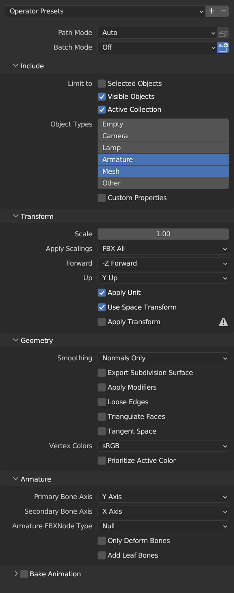
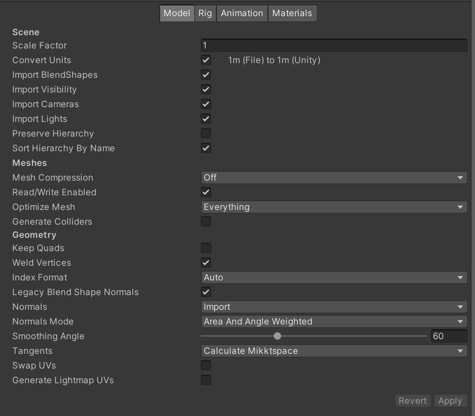
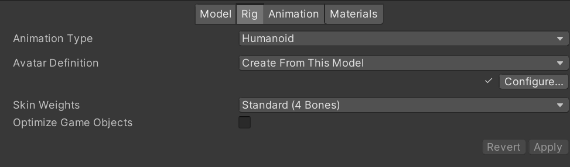
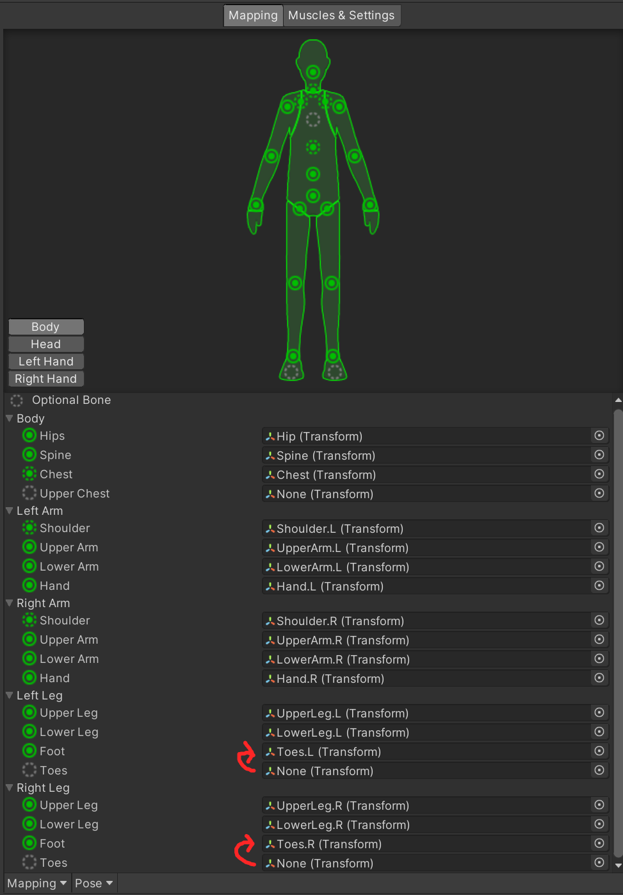

# Emperor of Mars' Avatar Guide
*squeak*

**Thank you for getting one of my avatars!**

***Please don't forget to rate your [Itch](https://emperorofmars.itch.io) and [Gumroad](https://emperorofmars.gumroad.com) products!***

## General Tips
* The only blendshapes that are meant for editing are contained within the `=== User Editing ===` section.
* The Blender file is set up, so you can just apply the `Subdivision Surface` modifier. Be sure to check the `Use Custom Normals` option under the advanced settings for that modifier. You may also want to remove all of the projected floof. These are parts which projected the UV map and normals from the main body and look ugly after subdivision. Usually they are selected by a vertex-group called something like `Project Floof` of `Hip and Shoulder Floof`.

## VRChat Setup
1) Set up a project with the [VRChat Creator Companion](https://vrchat.com/home/download)
2) Import the `.unitypackage`

The setup scene is located under `Assets/**AVATAR NAME**/Setup VRChat/Scenes`

Adapt and upload an avatar with the VRC SDK and have fun!

**Strongly recommended:** Use VRCFury with the `Blendshape Optimizer` and optionally `MMD Compatibility` features to upload a better performing avatar.

## ChilloutVR Setup (if included)
1) Set up a project with the current ChilloutVR [Unity Version](https://documentation.abinteractive.net/cck/setup/#download-unity)
2) Import the newest [CCK](https://documentation.abinteractive.net/cck/setup/#download-cck)
2) Import the `.unitypackage`

The setup scene is located under `Assets/**AVATAR NAME**/Setup ChilloutVR/Scenes`

Adapt and upload an avatar with the CVR SDK and have fun!

## VRM Setup (if included)
1) Set up a Unity project
2) Import the latest supported [UniVRM 0.X](https://github.com/vrm-c/UniVRM/releases)
3) Import the `.unitypackage`

The setup scene is located under `Assets/**AVATAR NAME**/Setup VRM/Scenes`

Export through UniVRM.
**Be sure to check the 'Reduce Blendshape' option**

## Blender Export
Use these export settings:

## Unity Import
* Drag the model into Unity and ensure that this are its import settings.
	* **Make sure that `Read/Write Enabled` and `Legacy Blend Shape Normals` is ticked.**

* In the `Rig` tab set the `Animation Type` to `Humanoid`.
* For the `Avatar Definition` you can either reuse one from the original Avatar, or if you modified the Rig, you must configure a new one. (To do so set the Animation Type to `None`, apply, and then set it again to `Humanoid`. Yes, Unity is stupid.)

* Ensure the `Avatar Definition` is configured the following way:
	* Unity sometimes doesn't map the `Chest`, ensure it is mapped.
	* Map the `Toes.L|R` as the Unity `Foot`.
	* Don't map the Unity `Toes`.
	* Unmap the `Jaw`. (Under Head)

---

### Contact / Links
**Find all my links at [mars.squirrel.pub](https://mars.squirrel.pub)**
* [Discord Server](https://discord.gg/MDggMXSttM)
* [Mastodon](https://squirrel.pub/@mars)
* [Bluesky](https://bsky.app/profile/mars.squirrel.pub)
* [Furaffinity](https://www.furaffinity.net/user/emperorofmars/)
* [Twatter](https://twitter.com/Emperor_of_Mars)
* [VRC Group](https://vrc.group/SQRL.0269)

\- Emperor of Mars

Cheers!
